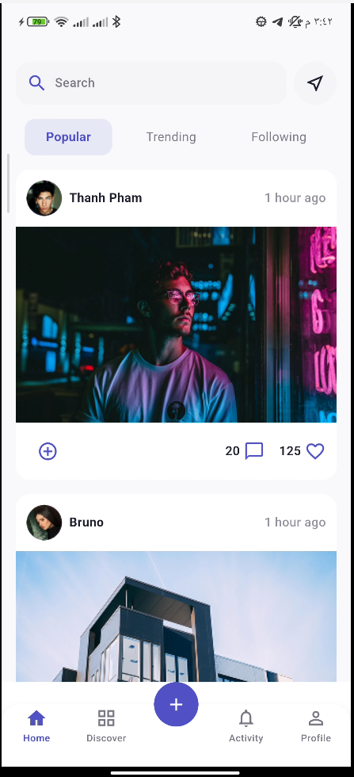
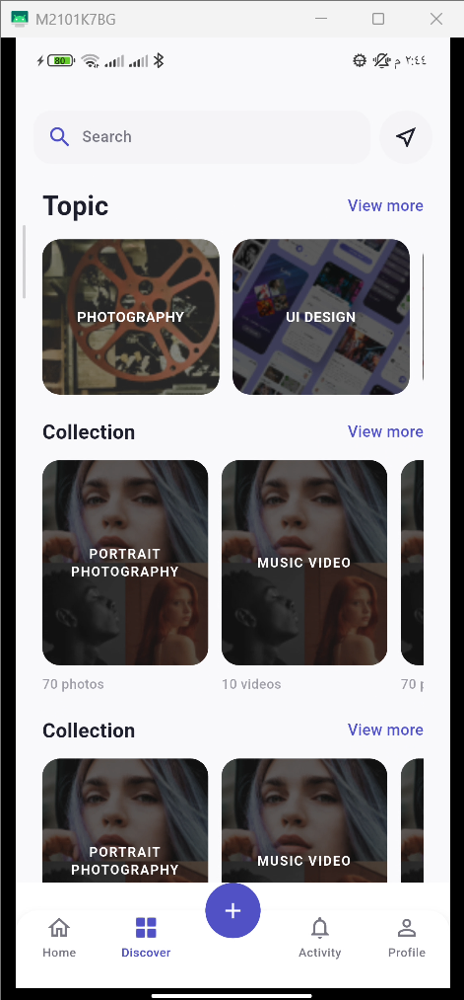
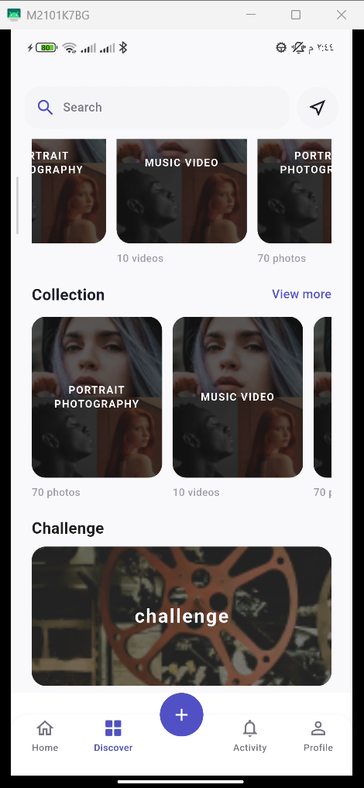
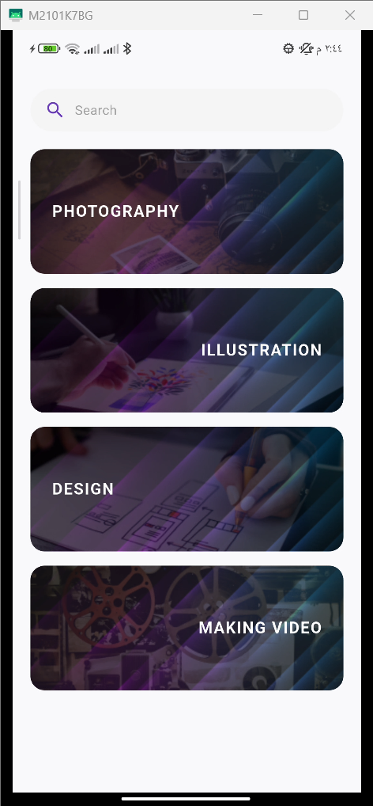
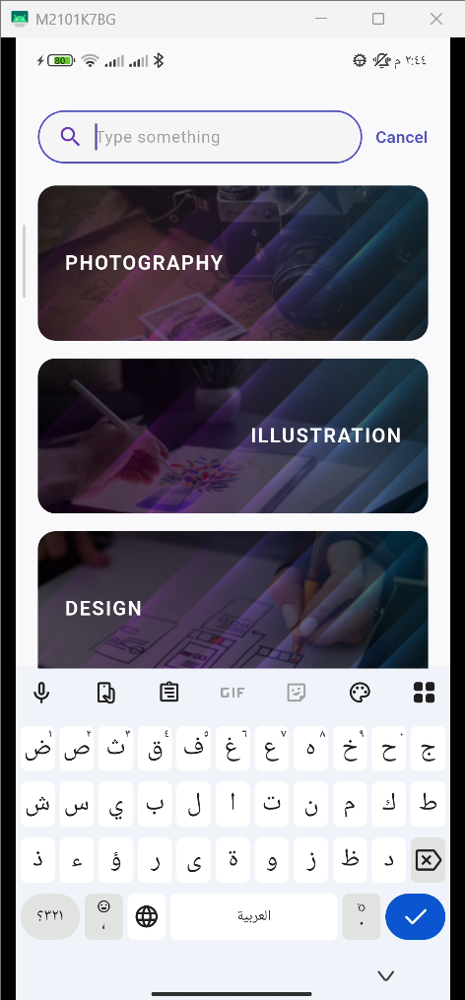
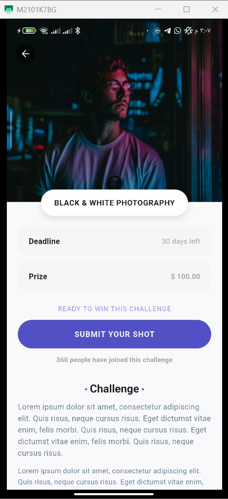
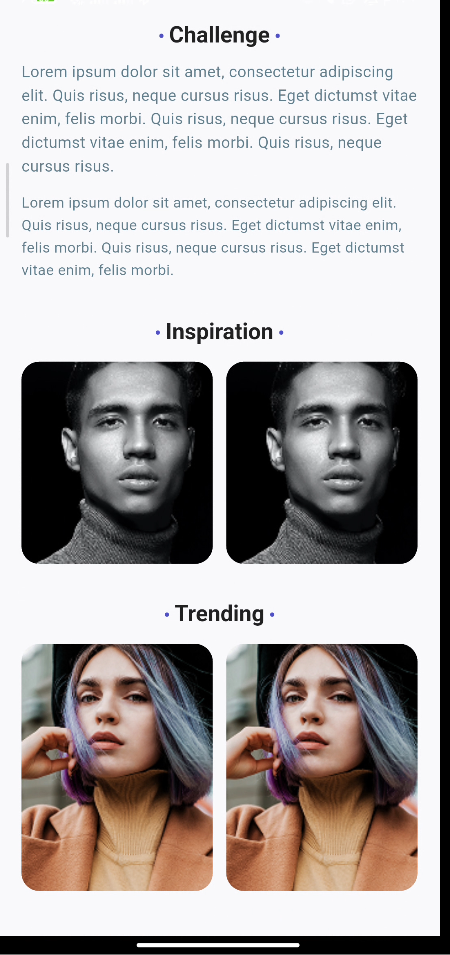

# social_app

A social media application for creative people to share, inspire, and connect.

### Authentication

<table>
  <tr>
    <td align="center"><b>Splash</b></td>
    <td align="center"><b>Onboarding</b></td>
    <td align="center"><b>Sign In</b></td>
  </tr>
  <tr>
    <td></td>
    <td></td>
    <td></td>
  </tr>
</table>

<table>
  <tr>
    <td align="center"><b>Sign Up</b></td>
    <td align="center"><b>Verification</b></td>
     <td align="center"><b>Forgot Password</b></td>
    <td align="center"><b>Set New Password</b></td>
    <td align="center"><b>Select Category</b></td>
  </tr>
  <tr>
    <td></td>
    <td></td>
     <td></td>
    <td></td>
    <td></td>
  </tr>
</table>

### Main Features & Screens

#### Home & Discovery
<table>
  <tr>
    <td align="center"><b>Home</b></td>
    <td align="center"><b>Discover 1</b></td>
    <td align="center"><b>Discover 2</b></td>
  </tr>
  <tr>
    <td></td>
    <td></td>
    <td></td>
  </tr>
</table>

#### Search & Challenge
<table>
  <tr>
    <td align="center"><b>Search 1</b></td>
    <td align="center"><b>Search 2</b></td>
    <td align="center"><b>Challenge</b></td>
  </tr>
  <tr>
    <td></td>
    <td></td>
    <td></td>
    <td></td>
  </tr>
